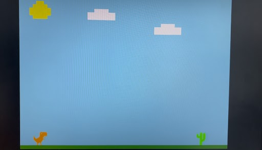

# 🦖 Jogo do T-Rex no FPGA (DE1-SoC)

Este projeto é uma versão do clássico jogo do T-Rex, implementado para a placa **DE1-SoC** da Altera (Intel). O jogo foi desenvolvido em C, utilizando os periféricos da placa para gerar gráficos em VGA e responder aos botões físicos.

## 🎮 Sobre o jogo

O T-Rex corre continuamente pela tela enquanto obstáculos (cactos) se aproximam da direita. O jogador deve pressionar o botão da placa (KEY0) para fazer o T-Rex pular e evitar colisões. O placar aumenta conforme o tempo passa e com ele a dificuldade do jogo.

## 🛠️ Tecnologias e ferramentas utilizadas

- **Linguagem C** para controle dos periféricos do HPS
- **Quartus Prime 18.1** para suporte à DE1-SoC
- **FPGA Monitor Program** para upload do código à placa
- **Placa DE1-SoC** com processador ARM Cortex-A9 (HPS)
- **Double buffering** e controle de frame buffer em VGA

## ▶️ Como rodar

Para executar o jogo na placa DE1-SoC, siga os passos abaixo:

1. Instale o Quartus Prime 18.1 em seu computador.
2. Baixe e instale o FPGA Monitor Program dentro da pasta de instalação do Quartus.
3. Ligue a placa DE1-SoC via cabo USB e cabo VGA (monitor externo).
4. Abra o FPGA Monitor Program.
5. Importe ou abra o projeto `.c` com o jogo do T-Rex.
6. Compile e carregue o código na FPGA.
7. O jogo será exibido automaticamente no monitor.

## 📷 Captura de tela

## 👨‍💻 Autores

- **Leonardo Ryuiti Miasiro**
- **Pedro Marchi Nunes**

Estudantes de **Engenharia da Computação** na **Universidade Federal de São Carlos (UFSCar)**.

Este projeto foi desenvolvido no **Departamento de Computação da UFSCar**, como trabalho prático da disciplina **Projetos de Sistemas Computacionais Embarcados**, ministrada pelo professor **Emerson Carlos Pedrino**.